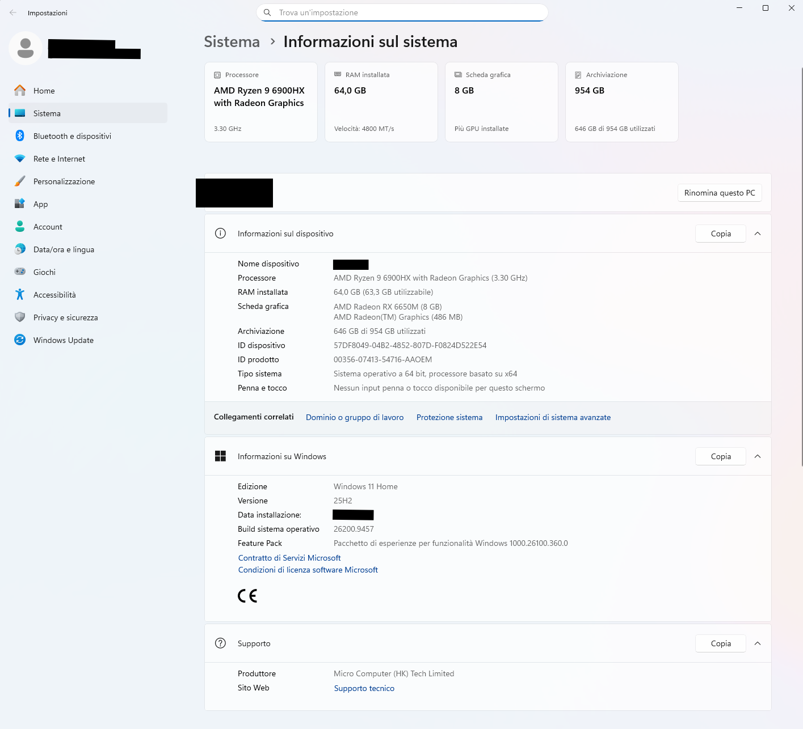
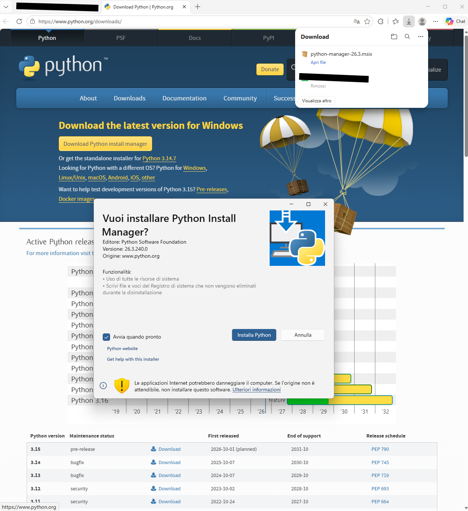
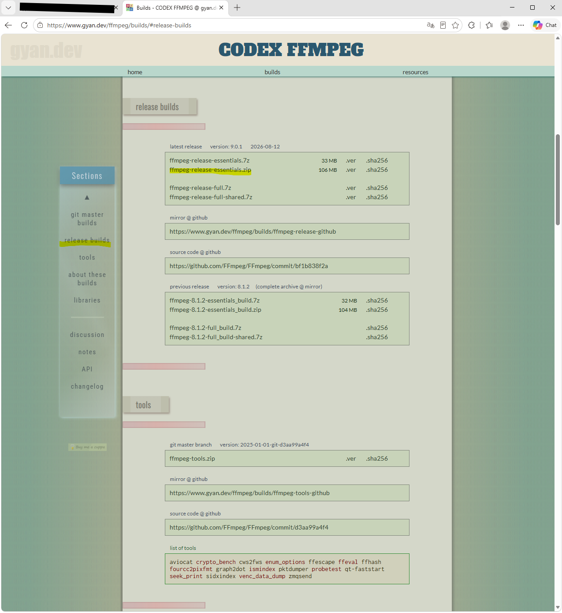
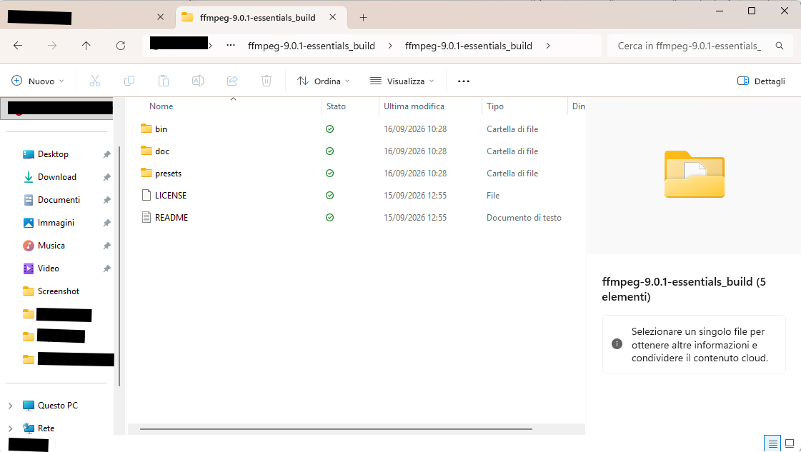
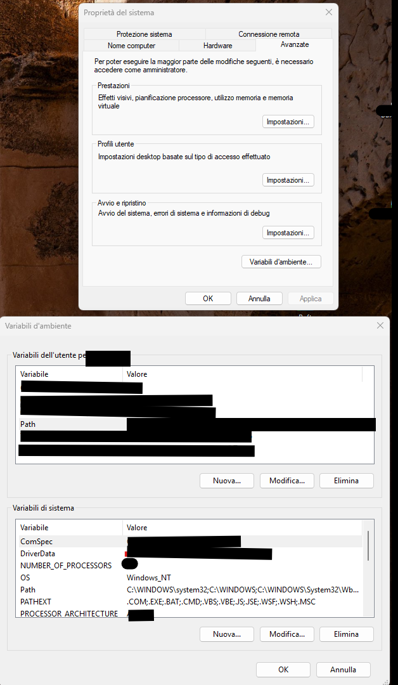
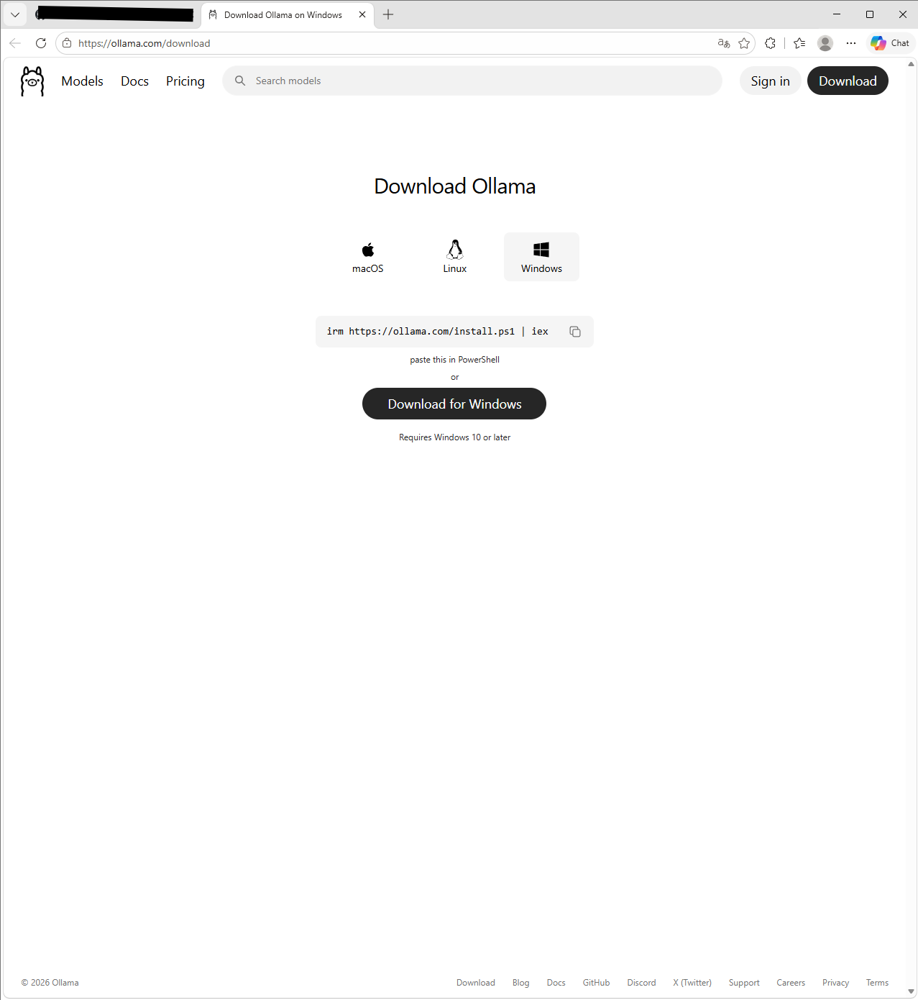

# Guida completa all'installazione e all'uso

Questo progetto è **completamente gratuito**: nessun costo, nessun abbonamento,
nessun account da creare. Ogni strumento usato (Python, FFmpeg, Ollama) è
gratuito, e tutta l'analisi gira in locale sul tuo PC — nessun dato viene
inviato altrove. Anche l'intelligenza artificiale che analizza il video
**gira interamente in locale sul tuo PC** (tramite Ollama): non è un servizio
online, non c'è nessun server esterno né sito web coinvolto, il tuo video
non lascia mai il tuo computer.

Domande, problemi o suggerimenti: **gdciateam@gmail.com**. Nonostante
l'indirizzo contenga "ia", a rispondere alle email è una persona reale (io),
non un'intelligenza artificiale generica.

Questa guida presuppone **zero esperienza** con terminale, Git o script. Ogni
passo dice esattamente dove cliccare. Se qualcosa non corrisponde a quello che
vedi tu, fermati e controlla la sezione [Problemi comuni](#problemi-comuni) in
fondo prima di andare avanti.

Legenda usata in questa guida:

- ✅ — cosa dovresti vedere se il passo è andato bene.
- ⚠️ — un errore facile da fare in quel punto specifico.
- 📸 — qui andrà uno screenshot (li aggiungiamo progressivamente).

Tempo richiesto: 20-30 minuti la prima volta (soprattutto per scaricare
Ollama e il modello AI, che pesano alcuni GB).

---

## Indice

0. [Requisiti minimi del PC e come verificarli](#0-requisiti-minimi-del-pc-e-come-verificarli)
1. [Installare Python](#1-installare-python)
2. [Installare FFmpeg](#2-installare-ffmpeg)
3. [Installare Ollama e il modello AI](#3-installare-ollama-e-il-modello-ai)
4. [Scaricare il progetto da GitHub](#4-scaricare-il-progetto-da-github)
5. [Aprire un terminale nella cartella giusta](#5-aprire-un-terminale-nella-cartella-giusta)
6. [Installare il plugin](#6-installare-il-plugin)
7. [Come copiare un percorso di file senza sbagliare](#7-come-copiare-un-percorso-di-file-senza-sbagliare)
8. [Analizzare un video](#8-analizzare-un-video)
9. [Costruire la timeline in Resolve](#9-costruire-la-timeline-in-resolve)
10. [Sostituire una clip del template con un tuo video](#10-sostituire-una-clip-del-template-con-un-tuo-video)
11. [Dove vengono creati i file (e come pulirli)](#11-dove-vengono-creati-i-file-e-come-pulirli)
12. [Problemi comuni](#problemi-comuni)

---

## 0. Requisiti minimi del PC e come verificarli

| Requisito | Minimo | Consigliato |
|---|---|---|
| Sistema operativo | Windows 10 64-bit | Windows 11 64-bit |
| RAM | 8 GB | 16 GB o più |
| Spazio libero su disco | 10 GB | 20 GB o più |
| CPU | qualsiasi CPU recente (4 core) | più core = analisi più veloce |
| GPU | non obbligatoria (funziona anche solo con CPU) | scheda dedicata NVIDIA/AMD con almeno 6 GB di memoria video = analisi AI molto più veloce |
| DaVinci Resolve | versione recente (Free o Studio) | — |

Perché questi numeri: Ollama tiene in memoria un modello AI di alcuni GB
mentre gira, DaVinci Resolve da solo ne usa parecchia, e i due potrebbero
essere aperti insieme — con 8 GB di RAM funziona ma può essere lento se hai
molti altri programmi aperti. Lo spazio su disco serve soprattutto per il
modello Ollama (`qwen2.5vl` pesa circa 5 GB) più i file temporanei generati
per ogni progetto analizzato.

⚠️ **Senza una GPU dedicata il plugin funziona comunque** (Ollama gira anche
solo su CPU, e Whisper per l'audio è pensato apposta per girare su CPU) —
sarà solo più lento nella fase di analisi AI dei singoli fotogrammi. Non è un
requisito bloccante, solo una questione di quanto aspetti.

### Come vedere le specifiche del tuo PC

**RAM, CPU e sistema operativo:**
1. Premi il tasto Windows, scrivi **"Informazioni sul sistema"** (o
   "Informazioni su questo PC") e aprilo.
2. Qui trovi processore, RAM installata ("Memoria RAM installata") e se il
   sistema è a 32 o 64 bit ("Tipo di sistema").

   

**Scheda video (GPU) e memoria dedicata:**
1. Apri **Task Manager** (clic destro sulla barra delle applicazioni, o
   Ctrl+Shift+Esc).
2. Vai sulla scheda **"Prestazioni"**, poi clicca **"GPU"** nel menu a
   sinistra.
3. In alto a destra trovi il nome della scheda video; in basso trovi
   **"Memoria GPU dedicata"** — è quel numero che conta per l'AI.

   📸 *Screenshot: Task Manager, scheda Prestazioni > GPU, con nome scheda e
   memoria dedicata evidenziati.*

**Spazio libero su disco:**
1. Apri Esplora File, clicca su **"Questo PC"**.
2. Sotto ogni disco (es. `C:`) vedi lo spazio libero indicato direttamente
   nella barra colorata.

---

## 1. Installare Python

1. Vai su **https://www.python.org/downloads/** e clicca il pulsante grande
   giallo "Download Python 3.x.x".
2. Apri il file scaricato (`python-3.x.x-amd64.exe`).
3. ⚠️ **Passo più importante di tutta questa sezione**: nella prima schermata
   dell'installer, in basso, c'è una casella **"Add python.exe to PATH"**
   (o "Aggiungi python.exe al PATH"). **Deve essere spuntata** prima di
   cliccare "Install Now" — se non la spunti, i comandi `python` scritti più
   avanti in questa guida non funzioneranno e dovrai reinstallare da capo.

   

   ⚠️ Nota: se il tuo installer si presenta come nello screenshot sopra (il
   nuovo "Python Install Manager" di python.org), potresti non vedere la
   casella "Add python.exe to PATH" in questa schermata iniziale — su questa
   versione dell'installer il PATH viene gestito in automatico o in una
   schermata successiva. In ogni caso, fai sempre la verifica al punto 5 qui
   sotto: se `python --version` funziona, va bene comunque.

4. Clicca "Install Now" e aspetta che finisca.
5. ✅ Verifica: apri un terminale (vedi [sezione 5](#5-aprire-un-terminale-nella-cartella-giusta)
   se non sai come) e scrivi:
   ```powershell
   python --version
   ```
   Dovresti vedere qualcosa come `Python 3.12.x`. Se invece vedi un errore
   tipo "python non è riconosciuto come comando", la casella del PATH non è
   stata spuntata: reinstalla Python ripetendo questo passo.

---

## 2. Installare FFmpeg

FFmpeg su Windows **non ha un installer**: si scarica una cartella già pronta
e va "collegata" manualmente al sistema. È il passo più macchinoso di tutta
la guida, ma va fatto una sola volta.

1. Vai su **https://www.gyan.dev/ffmpeg/builds/** (sito di riferimento per le
   build Windows di FFmpeg).
2. Cerca la sezione "release builds" e scarica lo **`ffmpeg-release-essentials.zip`**.

   

3. Il file scaricato di solito finisce nella cartella **Download**. Fai clic
   destro su `ffmpeg-release-essentials.zip` e scegli **"Estrai tutto..."**
   (in inglese "Extract All..."), poi **"Estrai"** nella finestra che appare
   (va bene estrarlo lì in Download, lo spostiamo al passo dopo). Dentro la
   cartella estratta trovi una sotto-cartella con un nome lungo tipo
   `ffmpeg-7.x-essentials_build`: è quella che ci serve.

   

4. Ora **sposta** questa cartella (`ffmpeg-7.x-essentials_build`, non quella
   attorno, se ne è stata creata una doppia) dentro `C:\` e rinominala in
   `ffmpeg`. Passo per passo, per non sbagliare:
   - Apri una **seconda** finestra di Esplora File (Windows+E), e nella barra
     dell'indirizzo in alto scrivi `C:\` e premi Invio: ora vedi il contenuto
     della radice del disco C.
   - Nella **prima** finestra (quella con la cartella estratta), clicca una
     volta sulla cartella `ffmpeg-7.x-essentials_build` per selezionarla, poi
     **Ctrl+X** (taglia — non Ctrl+C, che copia soltanto).
   - Passa alla **seconda** finestra (quella su `C:\`) e premi **Ctrl+V**
     (incolla). Se Windows chiede il permesso di amministratore per scrivere
     in `C:\`, conferma.
   - Ora, dentro `C:\`, fai clic destro sulla cartella appena incollata >
     **Rinomina** > scrivi `ffmpeg` (senza altro testo) e premi Invio.
   - Alla fine deve esistere esattamente il percorso `C:\ffmpeg\bin\ffmpeg.exe`
     — apri `C:\ffmpeg\bin` in Esplora File per controllare che `ffmpeg.exe`
     sia lì dentro.

   📸 *Screenshot: Esplora File con la cartella `C:\ffmpeg\bin` aperta, che
   mostra `ffmpeg.exe` dentro.*

5. Ora aggiungi `C:\ffmpeg\bin` al **PATH** di Windows:
   - Premi il tasto Windows, scrivi **"variabili di ambiente"** e apri
     "Modifica le variabili di ambiente relative al sistema".
   - Clicca il pulsante **"Variabili d'ambiente..."** in basso.

   

   - Nel riquadro superiore ("Variabili utente"), seleziona la riga **Path** e
     clicca **Modifica...**.
   - Clicca **Nuovo** e scrivi esattamente: `C:\ffmpeg\bin`
   - Clicca OK su tutte le finestre aperte (tre volte).

   📸 *Screenshot: finestra "Modifica variabile di ambiente" con
   `C:\ffmpeg\bin` appena aggiunto alla lista.*

6. ⚠️ **Chiudi e riapri PowerShell** (le finestre già aperte non vedono il
   PATH aggiornato).
7. ✅ Verifica:
   ```powershell
   ffmpeg -version
   ```
   Dovresti vedere alcune righe di informazioni sulla versione. Se vedi
   "ffmpeg non è riconosciuto", controlla che il percorso in `Path` sia
   scritto esattamente `C:\ffmpeg\bin` (non `C:\ffmpeg` da solo, non con uno
   spazio in più).

---

## 3. Installare Ollama e il modello AI

1. Vai su **https://ollama.com/download** e scarica la versione Windows.

   

2. Apri l'installer e segui i passi (non serve creare un account per l'uso
   locale da riga di comando — se il sito ti propone di registrarti, puoi
   saltare).
3. ✅ Verifica, in un **nuovo** terminale:
   ```powershell
   ollama --version
   ```
4. Scarica il modello AI usato per l'analisi (circa 5 GB, richiede qualche
   minuto):
   ```powershell
   ollama pull qwen2.5vl
   ```
   📸 *Screenshot: terminale con il download di `qwen2.5vl` completato al 100%.*

   ⚠️ Se il tuo PC ha una scheda video con poca memoria dedicata (meno di 6
   GB) o solo grafica integrata, puoi usare un modello più leggero — vedi la
   sezione "Configurare il backend AI" nel [README](README.md).

   💡 Se invece noti che la **trascrizione del parlato** (sezione 8) perde
   qualche parola nei tratti in cui si parla veloce, il file da modificare è
   lo stesso — vedi sempre "Configurare il backend AI" nel README per la
   chiave `whisper_model_size` (usa `"small"` per più precisione).

---

## 4. Scaricare il progetto da GitHub

Due modi — scegli quello più comodo per te.

### Opzione A — Download diretto (più semplice, consigliata se non conosci Git)

1. Vai sulla pagina del repository su GitHub.
2. Clicca il pulsante verde **"Code"**, poi **"Download ZIP"**.

   📸 *Screenshot: pulsante "Code" aperto con l'opzione "Download ZIP" evidenziata.*

3. Il file scaricato (qualcosa come `Model_Video_generator-main.zip`) di
   solito finisce nella cartella **Download**. Fai clic destro su di esso e
   scegli **"Estrai tutto..."**, poi **"Estrai"**.
4. ⚠️ **Il nome della cartella estratta NON sarà "AutoTemplate"**: GitHub la
   chiama automaticamente qualcosa come `Model_Video_generator-main`. Per non
   confonderti con il resto di questa guida (che parla sempre di una cartella
   chiamata `AutoTemplate`), rinominala tu:
   - Sposta quella cartella (Ctrl+X sulla cartella, poi Ctrl+V nella
     posizione finale) in un punto stabile del tuo PC — per esempio dentro
     **Documenti**. Evita il Desktop se hai OneDrive attivo sul Desktop: può
     rallentare o interferire con alcune operazioni (l'abbiamo visto
     succedere durante lo sviluppo).
   - Fai clic destro sulla cartella > **Rinomina** > scrivi `AutoTemplate` e
     premi Invio.
   - Alla fine deve esistere un percorso tipo `Documenti\AutoTemplate\README.md`
     — apri la cartella `AutoTemplate` e controlla di vedere dentro i file
     `README.md`, `requirements.txt`, la cartella `resolve_plugin`, ecc.
     (non una singola sotto-cartella con un altro nome lungo: se la vedi,
     sei entrato un livello in più che non serve — torna indietro di uno).

⚠️ Con questa opzione, per ricevere gli aggiornamenti futuri del plugin dovrai
riscaricare lo zip e sostituire la cartella a mano (con l'opzione B basta un
comando `git pull`).

### Opzione B — Git (consigliata se prevedi di aggiornare spesso)

1. Installa Git da **https://git-scm.com/download/win** (installer standard,
   next-next-next va bene).
2. Apri un terminale nella cartella dove vuoi salvare il progetto (vedi
   [sezione 5](#5-aprire-un-terminale-nella-cartella-giusta)) ed esegui:
   ```powershell
   git clone https://github.com/<utente>/<repo>.git AutoTemplate
   ```
   (sostituisci l'URL con quello reale del repository).

---

## 5. Aprire un terminale nella cartella giusta

Esistono due modi. Usa quello che preferisci, ma **usa sempre lo stesso**,
così non ti confondi.

### Metodo A — dal menu Start (il più semplice da ricordare)

1. Premi il tasto **Windows** sulla tastiera (non serve cliccare prima da
   nessuna parte).
2. Scrivi semplicemente: `powershell`

   ⚠️ Se il tuo PC mostra due risultati diversi ("Windows PowerShell" e
   "PowerShell"), va bene **uno qualsiasi dei due** — in questa guida
   "terminale", "PowerShell" e "prompt dei comandi" indicano sempre la stessa
   cosa: la finestra dove scrivere i comandi che seguono. Non usare invece
   "Prompt dei comandi"/"cmd" se compare tra i risultati: alcuni comandi di
   questa guida sono scritti per PowerShell e non funzionano identici lì.

   📸 *Screenshot: menu Start con "powershell" scritto e il risultato
   "Windows PowerShell" evidenziato.*

3. Premi **Invio** (o clicca sul risultato "Windows PowerShell"). Si apre una
   finestra blu/nera — è il terminale, vuoto e pronto.
4. ⚠️ **A questo punto la finestra NON è nella cartella del progetto** — devi
   spostartici tu con il comando `cd` (change directory), incollando il
   percorso della tua cartella `AutoTemplate` **tra virgolette**:
   ```powershell
   cd "C:\percorso\della\tua\cartella\AutoTemplate"
   ```
   Ogni persona ha questo percorso diverso, in base a dove ha estratto/clonato
   il progetto al [passo 4](#4-scaricare-il-progetto-da-github). Se non sei
   sicuro del percorso esatto, apri quella cartella in Esplora File, clicca
   sulla barra dell'indirizzo in alto (si seleziona tutto il percorso scritto
   lì), copialo (Ctrl+C), poi incollalo (Ctrl+V) tra le virgolette del comando
   `cd` sopra.

   📸 *Screenshot: Esplora File con la barra dell'indirizzo selezionata,
   che mostra il percorso della cartella AutoTemplate.*

5. ✅ Premi Invio: se non vedi errori, la riga del prompt ora finisce con il
   nome della cartella, es. `...\AutoTemplate>` — sei nel posto giusto. Da
   qui puoi eseguire `git pull`, `python scripts/install.py`, ecc.

   ⚠️ Errore tipico: `Impossibile trovare il percorso...` → il percorso
   incollato non è esatto (manca una parte, o c'è un carattere in più/in
   meno). Ricontrolla copiandolo di nuovo dalla barra degli indirizzi.

### Metodo B — direttamente da Esplora File (evita di scrivere `cd`)

1. Apri Esplora File e naviga fino a **dentro** la cartella `AutoTemplate`
   (quella che contiene i file `README.md`, `requirements.txt`, ecc. — non la
   cartella che la contiene).
2. Fai clic con il **tasto destro** su uno spazio vuoto dentro la cartella
   (non su un file).
3. Nel menu che appare:
   - Windows 11: clicca **"Apri nel Terminale"**.
   - Windows 10: tieni premuto **Shift** mentre fai clic destro, poi scegli
     **"Apri finestra di PowerShell qui"**.

   📸 *Screenshot: menu tasto destro dentro la cartella AutoTemplate, con
   "Apri nel Terminale" evidenziato.*

4. ✅ Si apre PowerShell già posizionato nella cartella giusta — **non serve
   scrivere `cd`**, la riga di comando mostra già il percorso della cartella
   `AutoTemplate`.

Da qui in avanti, ogni volta che questa guida dice "apri un terminale nella
cartella del progetto", ripeti il metodo che preferisci (A o B).

---

## 6. Installare il plugin

Nel terminale aperto al passo precedente:

```powershell
pip install -r requirements.txt
python scripts/install.py
```

✅ Il secondo comando, alla fine, stampa un messaggio che inizia con "Done."
e mostra un comando `python "...\run_build.py" "..."` — **tienilo a portata
di mano**, ti servirà al passo 8. Non serve copiarlo ora: potrai sempre
rilanciare `python scripts/install.py` per rivederlo.

---

## 7. Come copiare un percorso di file senza sbagliare

I percorsi Windows (es. `C:\Users\mario\Desktop\il mio video.mp4`) sono
scomodi da scrivere a mano: bastano uno spazio dimenticato o una virgoletta
mancante per bloccare tutto. Non scriverli mai a mano — fai così:

1. In Esplora File, trova il file che ti serve (es. il tuo video).
2. Tieni premuto **Shift** e fai clic con il **tasto destro** sul file.
3. Scegli **"Copia come percorso"** (in inglese "Copy as path").

   📸 *Screenshot: menu tasto destro su un file video con "Copia come
   percorso" evidenziato.*

4. Il percorso è ora copiato **già tra virgolette**, pronto per essere
   incollato dentro un comando, esattamente dove questa guida scrive
   `"C:\percorso\del\tuo\video.mp4"`.

⚠️ In Windows 11 questa voce potrebbe essere nascosta dentro **"Mostra altre
opzioni"** (l'icona con i tre puntini) del menu tasto destro.

---

## 8. Analizzare un video

### La logica del comando (leggi questa parte una volta, poi non dovrai più chiedere a nessuno)

Ogni analisi si lancia con **un unico comando** fatto di due parti ben
distinte — capire questa struttura una volta ti basta per sempre, anche per
video diversi:

```powershell
python "<PARTE FISSA: dove vive il plugin>" "<PARTE VARIABILE: il video da analizzare>"
```

- **La prima parte (`...\AutoTemplatePlugin\run_build.py`) non cambia mai**,
  a meno che tu non reinstalli il plugin su un altro PC o un altro utente
  Windows. È lo script che `python scripts/install.py` (passo 6) ha scritto
  dentro `C:\Users\<tuo-utente>\AppData\Roaming\AutoTemplatePlugin\`. La trovi
  anche riscrivendola sempre uguale ogni volta che rilanci
  `python scripts/install.py`, se te la sei persa.
- **La seconda parte è l'unica cosa che cambi ogni volta**: il percorso del
  video che vuoi analizzare in quel momento. Copialo sempre con **Shift +
  clic destro > "Copia come percorso"** (spiegato al
  [passo 7](#7-come-copiare-un-percorso-di-file-senza-sbagliare)) invece di
  scriverlo a mano — elimina qualsiasi errore di spazi o virgolette.

In pratica, per **ogni nuovo video** che vuoi analizzare, il procedimento è
sempre identico:

1. Apri DaVinci Resolve e crea/apri un progetto — **deve restare aperto**,
   ti servirà al passo successivo (passo 9).
2. Apri un terminale (metodo A o B del [passo 5](#5-aprire-un-terminale-nella-cartella-giusta) — per questo comando non serve che sia dentro la cartella del progetto).
3. Copia il percorso del video che vuoi analizzare (passo 7).
4. Scrivi `python `, poi il percorso fisso di `run_build.py` tra virgolette,
   poi uno spazio, poi incolla (Ctrl+V) il percorso del video appena
   copiato — risultato tipo:
   ```powershell
   python "C:\Users\<tuo-utente>\AppData\Roaming\AutoTemplatePlugin\run_build.py" "C:\percorso\del\tuo\video.mp4"
   ```
5. Premi Invio.

⚠️ **Non serve rifare `git pull` o `python scripts/install.py` prima di ogni
analisi** — quei due comandi servono solo quando il *codice del plugin* è
stato aggiornato (nuova versione da GitHub). Per analizzare un video nuovo
con la stessa versione del plugin già installata, basta il comando sopra,
cambiando solo il percorso del video.

6. ✅ Vedrai una serie di righe di avanzamento tipo:
   ```
   [0/100] Reading video metadata...
   [5/100] Detecting cuts...
   [20/100] Detecting empty/black spaces...
   [30/100] Transcribing voice & separating music...
   [40/100] Analyzing clip 1/28 (text & effects)...
   ```
   Per un video sotto i 2 minuti, aspettati da una decina di secondi fino a
   qualche minuto, soprattutto durante la fase "Analyzing clip" (usa l'AI
   locale, la parte più lenta). **Non chiudere la finestra** finché non vedi
   il messaggio finale "Fatto! ...".

   📸 *Screenshot: terminale a fine analisi, con il messaggio "Fatto! In
   Resolve vai su Workspace > Scripts > Edit > ..." visibile.*

---

## 9. Costruire la timeline in Resolve

1. In DaVinci Resolve, in alto, vai su **Workspace > Scripts > Edit** (in
   italiano: **Spazio lavoro > Script > Edit**).
2. Se non vedi subito la voce nuova, chiudi il menu e riaprilo.
3. Clicca sulla voce che inizia con **"Auto Template - ..."**.

   📸 *Screenshot: menu Workspace > Scripts > Edit con la voce "Auto
   Template - ..." visibile ed evidenziata.*

4. ✅ Dopo pochi secondi, Resolve crea automaticamente una nuova timeline nel
   progetto corrente con tagli, testi, tracce audio voce/musica e marker
   gialli sugli effetti — vedi la checklist completa nel [README](README.md#checklist-di-verifica-manuale-da-fare-su-windows-con-resolve).

---

## 10. Sostituire una clip del template con un tuo video

A questo punto hai una timeline con la **struttura** del video analizzato
(tagli, ritmo, testi, effetti segnalati) ma con le clip **originali** di quel
video. Il passo finale è sostituire quelle clip con i tuoi video, mantenendo
intatte durata, posizione ed effetti già applicati — in Resolve questo si fa
con il **Replace Edit** (non serve nessun comando del plugin, è una funzione
nativa di Resolve).

1. **Porta il tuo video nella Media Pool**: trascina il file dal tuo PC dentro
   il pannello "Master" in alto a sinistra (o clic destro nel pannello >
   "Aggiungi file multimediale...").
2. **Seleziona la tua clip** nella Media Pool cliccandoci sopra una volta.
   Se vuoi che inizi da un punto preciso del tuo video (non dall'inizio),
   aprila nel visore a sinistra e imposta un punto di ingresso premendo **I**
   sul fotogramma desiderato.
3. **Sposta la playhead** (la lineetta verticale rossa) sulla timeline, sopra
   la clip del template che vuoi sostituire — un click sulla riga del
   timecode, in corrispondenza di quella clip, basta.
4. **Clicca la clip da sostituire** nella timeline per selezionarla.
5. Premi **F11** (Replace Edit). La clip del template viene sostituita dal
   tuo video, mantenendo esattamente la stessa durata e gli stessi eventuali
   effetti/colorazione già impostati su quella posizione.

   📸 *Screenshot: timeline con una clip appena sostituita tramite Replace Edit.*

⚠️ Metodo alternativo col mouse, se preferisci: trascina la tua clip dalla
Media Pool **sopra** la clip nella timeline tenendo premuto **Alt** (Windows)
prima di rilasciare — anche questo la sostituisce mantenendo la durata
originale.

✅ Verifica sempre riproducendo il tratto appena sostituito, per controllare
che l'inquadratura sia quella desiderata.

Ripeti questi passi per ogni clip del template che vuoi sostituire con un tuo
video.

---

## 11. Dove vengono creati i file (e come pulirli)

Ogni volta che analizzi un video (passo 8), il plugin crea file in **due
posti diversi** sul tuo PC — nessuno dei due viene mai pulito
automaticamente, quindi si accumulano ad ogni prova. Un terzo posto contiene
il plugin stesso (installato una sola volta, non per ogni prova) e non va
mai toccato a mano.

### 1. `C:\Users\<tuo-utente>\AutoTemplateProjects\` — una cartella per ogni analisi

Ogni volta che lanci `run_build.py` su un video (anche riprovando lo stesso
video più volte), qui dentro nasce una **nuova sottocartella**. Dentro trovi:

| File | Cosa è |
|---|---|
| `source_video.mp4` (o altra estensione) | **Copia** del tuo video originale — l'originale sul tuo Desktop/altrove non viene mai toccato |
| `on_screen_text.srt` / `dialogue.srt` | Sottotitoli generati (solo se il video aveva testo a schermo/parlato) |
| `placeholder_XXs.mp4` | Piccoli video neri "segnaposto" per i gap/pause tra le clip |
| `silence_XXs.wav` | Audio silenzioso "segnaposto" per riempire i buchi nelle tracce Voce/Musica |

È la cartella che pesa di più: ogni prova include una copia intera del
video analizzato.

### 2. `C:\Users\<tuo-utente>\AppData\Roaming\Blackmagic Design\DaVinci Resolve\Support\Fusion\Scripts\Edit\` — uno script per ogni analisi

Qui trovi un file `Auto Template - <nome video>....lua` per ogni analisi
fatta — è esattamente quello che vedi nel menu **Workspace > Scripts > Edit**
di Resolve al passo 9. Anche questi si accumulano indefinitamente e
affollano quel menu.

### 3. `C:\Users\<tuo-utente>\AppData\Roaming\AutoTemplatePlugin\` — il plugin installato (non toccare)

Questa **non** è una cartella per test: è una singola copia del codice del
plugin, scritta da `python scripts/install.py` (passo 6) e sovrascritta ogni
volta che lo rilanci. Non serve mai pulirla a mano.

### Come pulire, tenendo solo l'ultima prova buona

1. Apri Esplora File e vai su `C:\Users\<tuo-utente>\AutoTemplateProjects\`.
2. Clicca sull'intestazione della colonna **"Data modifica"** per ordinare
   (clicca due volte se serve, per avere il più recente in cima).
3. La cartella più recente è la tua ultima prova — apri quella cartella e
   controlla che `source_video.mp4` corrisponda al video giusto, per
   sicurezza.
4. Seleziona **tutte le altre cartelle** (clic sulla prima, poi Shift+clic
   sull'ultima) e premi **Canc** per eliminarle.
5. Vai su `C:\Users\<tuo-utente>\AppData\Roaming\Blackmagic Design\DaVinci
   Resolve\Support\Fusion\Scripts\Edit\`.
6. Stessa cosa: ordina per data, individua il file `.lua` più recente (deve
   corrispondere alla cartella che hai tenuto al passo 4), elimina tutti gli
   altri file `Auto Template - ...lua`.
7. Riapri Resolve (o chiudi/riapri il menu Workspace > Scripts > Edit) per
   vedere il menu pulito.

⚠️ Non toccare mai i tuoi video originali (quelli sul Desktop o dove li hai
salvati tu): non vengono mai creati/modificati da questo plugin, sono
sempre solo tuoi.

---

## Problemi comuni

**`git pull` chiede "Should I try again? (y/n)" per una cartella che non
riesce a cancellare.**
Qualcosa ha quella cartella "in uso" (Esplora File aperto su di essa, o
OneDrive che sta ancora sincronizzando). Chiudi ogni finestra che la
riguarda, poi rispondi `y`. Se continua a fallire, rispondi `n` e poi esegui
`git pull` di nuovo — di solito la seconda volta funziona.

**Il terminale sembra "bloccato" dopo aver scritto un comando.**
Controlla di aver premuto **Invio** — a volte il comando resta scritto ma
non è stato lanciato. Se hai premuto Invio e non succede nulla per più di un
minuto, apri Task Manager (Ctrl+Shift+Esc), cerca **python** nella barra di
ricerca in alto: se vedi un processo attivo, sta ancora lavorando, aspetta.

**Errore "python non è riconosciuto come comando" (o lo stesso per `ffmpeg`,
`ollama`, `git`).**
Il programma non è nel PATH di Windows, oppure hai aperto il terminale prima
di installarlo. Chiudi **tutte** le finestre PowerShell aperte, aprine una
nuova e riprova. Se persiste, rivedi il passo di installazione del programma
in questione (in particolare per Python, controlla la casella "Add to PATH").

**Errore Python `PermissionError: Accesso negato` durante
`python scripts/install.py`.**
Di solito è l'antivirus che sta scansionando i file appena copiati. Aspetta
qualche secondo e rilancia lo stesso comando: di norma la seconda volta va a
buon fine.

**Workspace > Scripts > Edit non mostra nessuna voce "Auto Template - ...".**
- Controlla che il comando `run_build.py` sia arrivato fino in fondo,
  stampando il messaggio "Fatto! ...".
- Chiudi il menu Script e riaprilo (Resolve a volte non aggiorna
  immediatamente la lista).
- Verifica di avere DaVinci Resolve aggiornato all'ultima versione — versioni
  molto vecchie potrebbero non avere la categoria "Edit" nel menu Script.

**In Resolve, dopo aver lanciato lo script, non succede visibilmente nulla.**
Controlla che ci sia un progetto Resolve aperto (non solo la schermata
iniziale "Project Manager") prima di lanciare lo script.

Per limiti noti non risolvibili (es. le transizioni non si riapplicano da
sole) vedi la sezione "Limiti noti" nel [README](README.md#limiti-noti).
